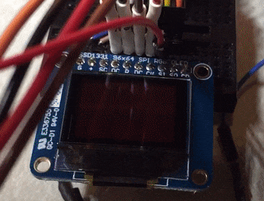

# 6S194-lab
OLED color vs power characterization tools for Cypress PSoc 4.

**Update Jan 20, 2016:** the code in this repo works but it still needs to be refactored! It's a bit messy at the moment.

### Overview
This project aims to understand how displaying different colors on an OLED display changes power consumed. Put another way, how do OLED displays deviate from non-ideal linear behavior? For this project I used a Cypress PSoC eval board with an INA219 voltage/current monitor and collection of Adafruit OLED displays on breakout boards.

Here are some preliminary results:

### Project Motivation
Many wearable devices today have a large screen, but are fundamentally limited in maximum energy storage by technology/size of the battery. This project was a chance to understand a bit more about energy-efficient optimizations one could make to the output of a display, to achieve better system efficiency while minimizing changes to user experience.

### Why PSoC 4, not Arduino?
Arduino is extremely useful for fast prototyping, but one of the goals for this project was to learn a new dev platform, and really take a command-by-command deep dive into the firmware. I selected the Cypress PSoC 4 because it has a great and free IDE, a very solid eval kit, and all the obigatory [low-power modes](http://www.cypress.com/file/121271/download). Cypress documentation is efficient and helpful (e.g., [PSoC 101 video tutorials](http://www.cypress.com/training/psoc-101-video-tutorial-series-how-use-arm-cortex-m0-based-psoc-4)). 

========

### Hardware
- [PSoC CY8CKIT-042-BLE Pioneer Kit](http://www.cypress.com/documentation/development-kitsboards/cy8ckit-042-ble-bluetooth-low-energy-ble-pioneer-kit)
- [Adafruit INA219 Breakout Board](https://www.adafruit.com/product/904)
- 3x [Adafruit 0.96" OLED Display Breakout Board](https://www.adafruit.com/products/684)
- Other [OLED Displays](https://www.adafruit.com/products/1431) for comparison
- For debug: [Saleae Logic 8](https://www.saleae.com/) logic analyzer

### Software
- [PSoC Creator 4.0](http://www.cypress.com/products/psoc-creator-integrated-design-environment-ide) on Windows 10

### Acknowledgements
Thank you to [Dr. Phillip Stanley-Marbell](http://www.phillipstanleymarbell.org/) for idea/debugging/analysis help and [Adafruit](https://github.com/adafruit) for amazing firmware libraries.
